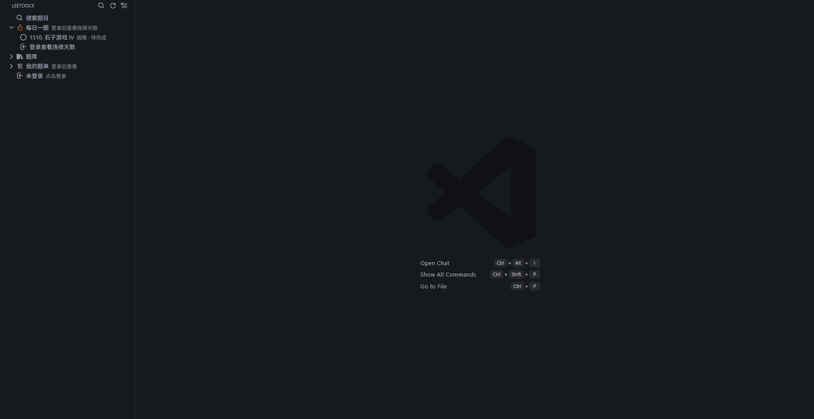
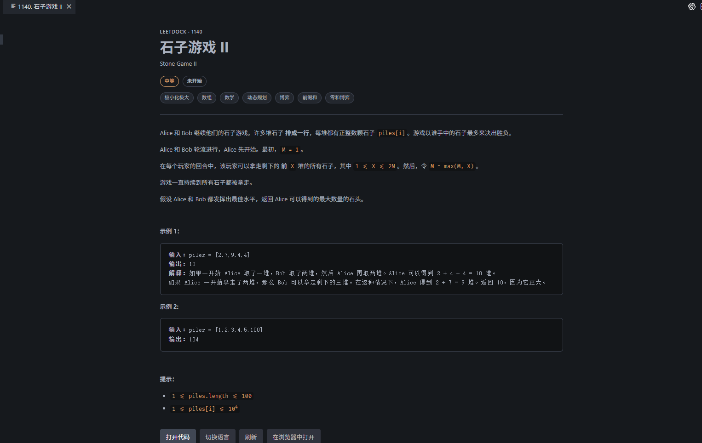
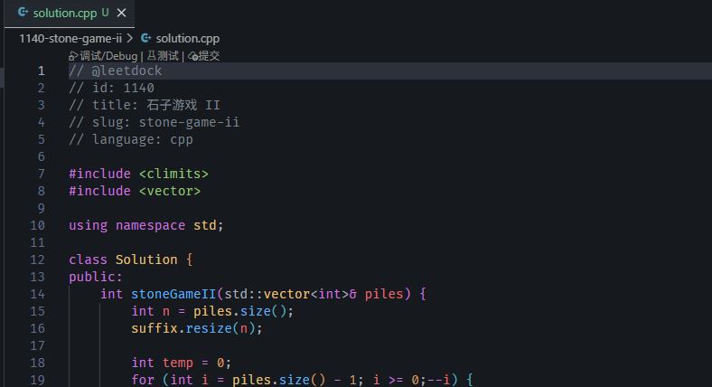
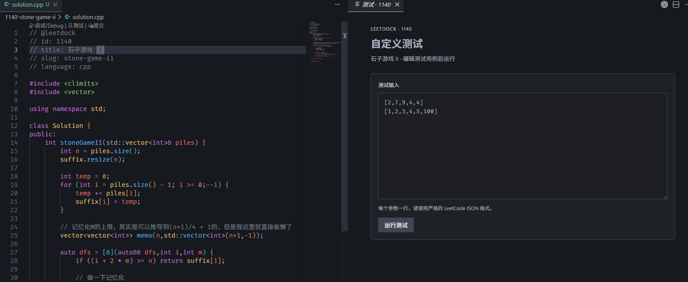

[![contributors][contributors-shield]][contributors-url]
[![fork][forks-shield]][forks-url]
[![star][stars-shield]][stars-url]
[![issue][issues-shield]][issues-url]

  
  <h1>LeetDock</h1>
  

    面向力扣中国站的 Visual Studio Code 刷题插件
     
    <a href="https://github.com/cooronx/leetdock/issues">issues</a>
    <a href="https://linux.do/">
      Linux.do
    </a>
  

  
目录

  <ol>
    <li><a href="#关于-leetdock">关于 LeetDock</a></li>
    <li><a href="#功能概览">功能概览</a></li>
    <li><a href="#c-本地调试">C++ 本地调试</a></li>
    <li><a href="#数据与隐私">数据与隐私</a></li>
    <li><a href="#参与贡献">参与贡献</a></li>
    <li><a href="#联系方式">联系方式</a></li>
    <li><a href="#致谢">致谢</a></li>
  </ol>

## 关于 LeetDock

LeetDock 是一个连接 [力扣中国站](https://leetcode.cn) 的 vscode(cursor) 扩展，目标是在编辑器内提供从浏览题目、编写代码到测试、提交和调试的一体化刷题体验。

> 主要是我自己在vscode中有刷题的需求，但是官方的插件很久都没更新过了。而且我想做我自己收藏的题单，官方插件也没有这个功能，于是自己做了一个这样的插件

（<a href="#readme-top">返回顶部</a>）

## 功能概览

- 超级简单的登录方式，自动跳转网页授权即可完成登录
- 支持按题号、中文名、英文名、题目链接搜索并打开题目。
- 使用独立题目页面美观的展示中文题面、难度、标签、状态、提示与 KaTeX 公式。
- 语言支持： C++、Rust、Python、Java、TypeScript（持续更新中）。
- 在vscode中测试样例或提交代码，并查看判题结果。
- 支持使用自定义的样例进行测试以及本地调试
- 支持在vscode中进行单步调试（暂时只支持C++）。
- 在侧栏展示每日一题、连续完成天数、个人题单，以及按难度、标签和公司分类的题库（公司题库需要 Plus 会员）。
- 支持题目数据缓存、手动刷新和缓存清理。
- 持续更新，因为我自己也在使用，感觉也有很多欠缺的地方🤣

（<a href="#readme-top">返回顶部</a>）

## 快速开始

### 1. 登录力扣

登录超级简单🌹

安装并启用 LeetDock 后，在侧边栏中点击登录。插件会自动打开浏览器进行授权，授权完成后点击返回 VS Code 即可完成登录。

在 Remote-SSH、WSL 或 Dev Container 窗口中，LeetDock 会自动安装并使用本地网络组件。登录凭据和所有力扣网络请求留在本机，代码文件、编译和调试仍在远程工作区执行。从旧版本升级后需要重新登录一次，将凭据迁移到本地组件。

### 2. 浏览题目

通过侧边栏搜索并打开题目，即可在独立页面中查看中文题面、示例、提示和相关标签。

### 3. 编写代码

点击题目页面底部的“打开代码”，选择编程语言后即可生成对应的解题文件并开始编写代码。

### 4. 测试与提交

在编辑器顶部或右键菜单中选择“测试”，输入自定义测试用例后即可直接运行；完成后也可以从相同位置提交代码。

（<a href="#readme-top">返回顶部</a>）

## 参与贡献

欢迎提交 Issue 和 Pull Request。报告问题时，请尽量附上 VS Code 版本、LeetDock 版本、操作系统、复现步骤以及相关输出日志。

（<a href="#readme-top">返回顶部</a>）

## 联系方式

cooronx — [2197083441@qq.com](mailto:2197083441@qq.com)

项目地址：[github.com/cooronx/leetdock](https://github.com/cooronx/leetdock)

（<a href="#readme-top">返回顶部</a>）

## 致谢

- [力扣中国站](https://leetcode.cn)

（<a href="#readme-top">返回顶部</a>）

[contributors-shield]: https://img.shields.io/github/contributors/cooronx/leetdock.svg?style=for-the-badge
[contributors-url]: https://github.com/cooronx/leetdock/graphs/contributors
[forks-shield]: https://img.shields.io/github/forks/cooronx/leetdock.svg?style=for-the-badge
[forks-url]: https://github.com/cooronx/leetdock/network/members
[stars-shield]: https://img.shields.io/github/stars/cooronx/leetdock.svg?style=for-the-badge
[stars-url]: https://github.com/cooronx/leetdock/stargazers
[issues-shield]: https://img.shields.io/github/issues/cooronx/leetdock.svg?style=for-the-badge
[issues-url]: https://github.com/cooronx/leetdock/issues
